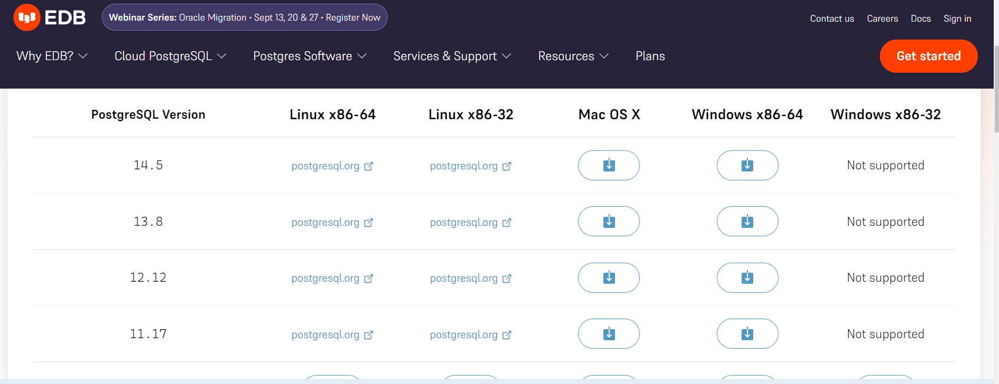
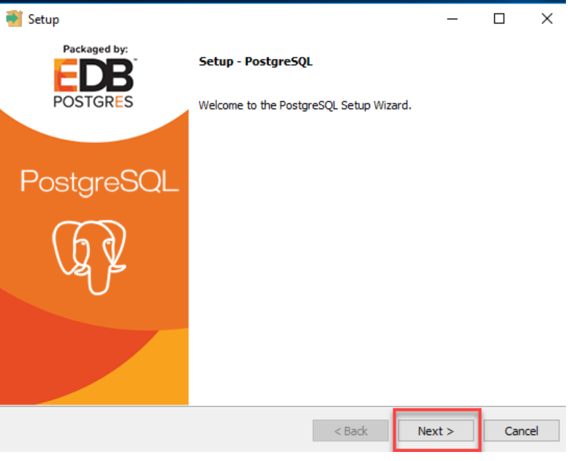
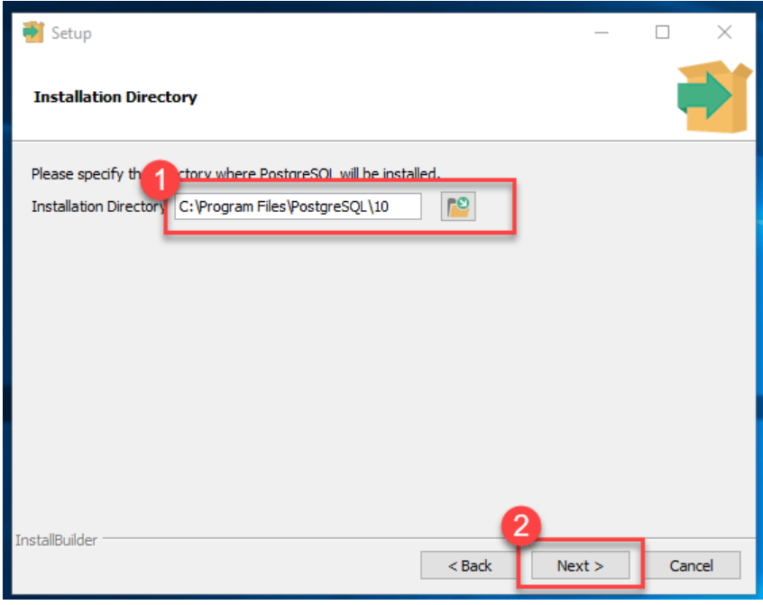
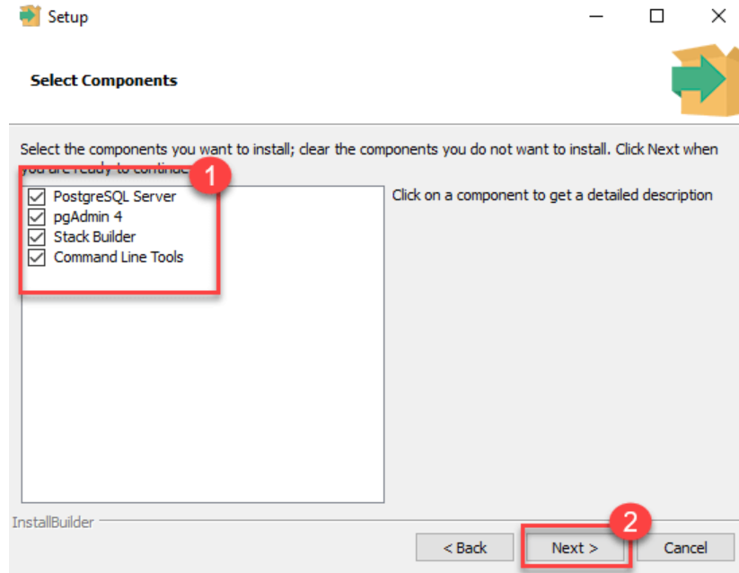
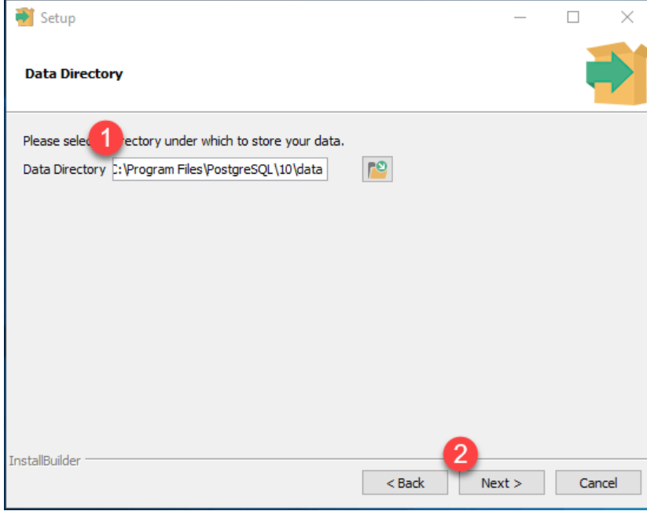
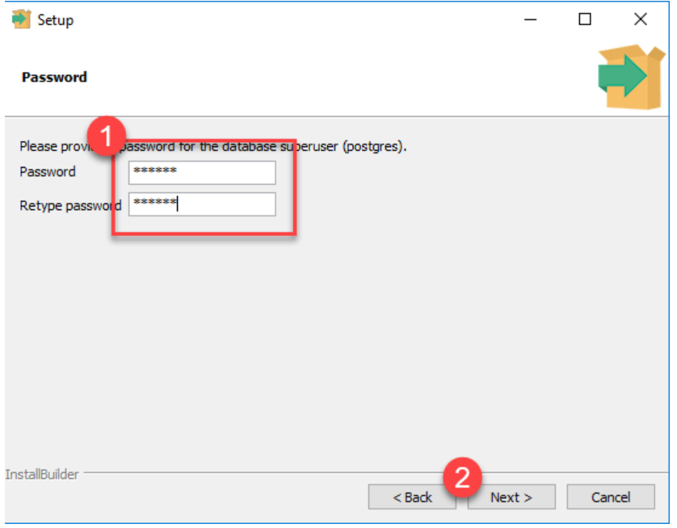
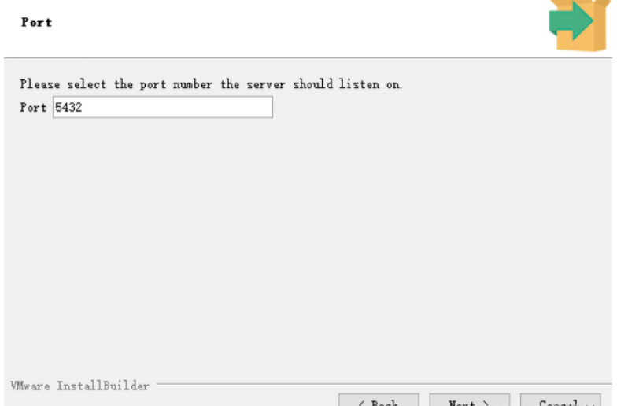
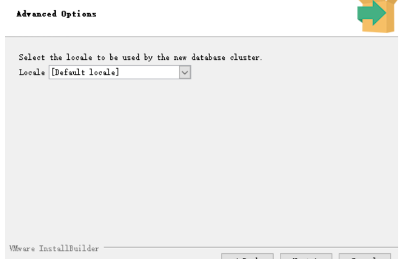
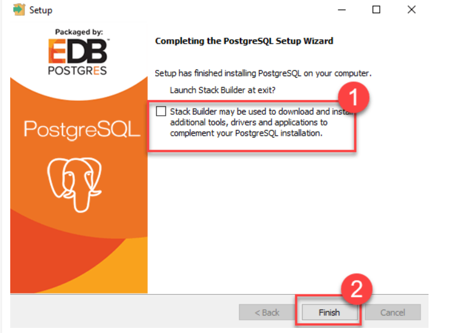
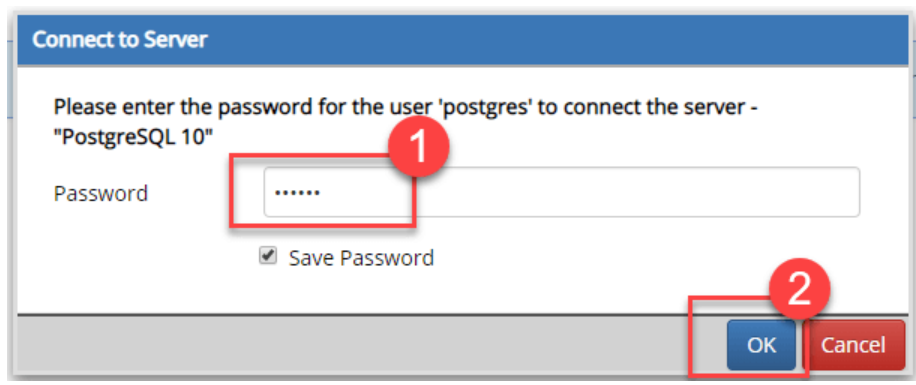

## Windows平台安装

### 下载以及安装

https://www.enterprisedb.com/downloads/postgres-postgresql-downloads
根据自己情况下载对应平台和版本 

下载完成后，双击下载安装包，开始安装(安装时候可能存在电脑用户名中文无法安装，可以更改名字后在安装) 

你可以修改安装路径 

选择安装组件，不懂的选就是全部勾上： 

设置数据库路径(根据自己情况选择目录) 

设置超级用户的密码 

数据库服务端口号，默认端口号即可 

系统语言/地区，建议选择默认 

后面直接点 Next 直到安装完成 

安装完成，弹出默认启动Stack Builder，可以取消 

### 启动服务

打开 pgAdmin 4 

输入前面设置的密码 

