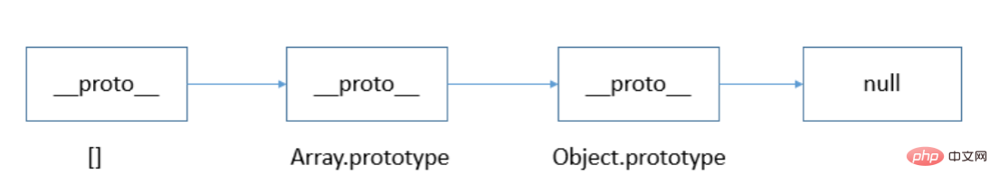

## 类型：

栈(stack)：基本数据类型
String、Number、Boolean、Null、Undefined、Symbol、BigInt

堆(heap): 引用数据类型
Object【Object是个大类，function函数、array数组、date日期...等都归属于Object】


### Number
- JavaScript 只有一种数字类型。数字可以带小数点，也可以不带

**数值范围：**
- 5e324 ~ 1.7976931348623157e+308
- 如果超过范围，会表示为 **Infinity** 或者 **-Infinity**

**特殊的数值NaN：**
- NaN是number类型，是一个数值
- 特点1：NaN与任何数进行任何运算结果都是NaN
- 特点2：NaN与任何数都不相等，包括自己

**相关函数：**
  - `isNaN() 判断数据是否是NaN， 是返回true，否则返回false`
  - `isFinite() 判断数据是否在范围内，在范围内返回true，否则false`


### String
- 字符串是存储字符（比如 "Bill Gates"）的变量

- 字符串可以是引号中的任意文本。可以使用单引号或双引号

- 使用单引号或者双引号，没有区别

- 单引号不要嵌套单引号。双引号同理，非要嵌套需要对引号进行转义 \' \"

**其他转义字符：**
- ` \n ` 表示换行符
- ` \r ` 表示回车符
- ` \t ` 水平制表符 tab
- ` \' ` 单引号   
- ` \" ` 双引号   
- ` \\ ` 反斜杠 
- ` \uXXXX ` 四位十六进制表示unicode字符串
- ` \xXX ` 两位十六进制表示拉丁字符


### Boolean
布尔（逻辑）只能有两个值：true 或 false

### Null
null 表示没有对象，此处无值


### undefined
undefined 表示缺少值，本来应该有值但没定义


### object

对象由花括号分隔。在括号内部，对象的属性以键值对的形式 (name : value) 来定义。属性由逗号分隔

```javascript
//空格和折行无关紧要。声明可横跨多行
var obj = {
  "name":"张三",
  "age":18
}
```
（这里键名也可以不用加引号） 

**读取对象中属性：**
```javascript
name = obj.name
//或
name = obj['name']
```

### symbol(es6新增)

Symbol 函数可以接受一个字符串作为参数，为新创建的 Symbol 提供描述，用来显示在控制台或者作为字符串的时候使用，便于区分
```javascript
let name = Symbol();
let name2 = Symbol("bb");
console.log(name);  // Symbol()
console.log(typeof name);  // "symbol"
console.log(name,name2); //Symbol() Symbol(bb)
console.log( name === name2); // false
```

### bigInt(谷歌67版本中新增)
- 解决number数值超出精度问题
- js中number类型只能安全的表示-9007199254740991(-(2^53-1))
- 和9007199254740991（(2^53-1)） 任何超出此范围的整数值都可能失去精度。
如：
```javascript
console.log(9999999999999999999); // 10000000000000000000
console.log( 9007199254740995 );  //  9007199254740996
console.log( 9007199254740995n ); // 9007199254740995n
```

Javascript 中的任意精度整数，可以安全存储和操作大整数。即始超出 Number 能够表示的安全整数范围。是 chrome 67中的新功能。

BigInt 是一种数字类型的数据，它可以表示任意精度格式的整数。而在其他编程语言中，可以存在不同的数字类型，例如:整数、浮点数、双精度数或大斐波数。

JavaScript 所有数字都保存成 64 位浮点数，这给数值的表示带来了两大限制。一是数值的精度只能到 53 个二进制位（相当于 16 个十进制位），大于这个范围的整数，JavaScript 是无法精确表示的，这使得 JavaScript 不适合进行科学和金融方面的精确计算。二是大于或等于2的1024次方的数值，JavaScript 无法表示，会返回Infinity。

```javascript
// 超过 53 个二进制位的数值，无法保持精度
Math.pow(2, 53) === Math.pow(2, 53) + 1 // true
// 超过 2 的 1024 次方的数值，无法表示
Math.pow(2, 1024) // Infinity
```

ES2020 引入了一种新的数据类型 BigInt，来解决这个问题。BigInt 只用来表示整数，没有位数的限制，任何位数的整数都可以精确表示。

为了与 Number 类型进行区分，BigInt 类型的数据必须添加后缀n。
```javascript
12  // 普通Number
12n // BigInt
 
// BigInt 的运算
1n + 2n // 3n
111111111111111111111111111111111111111111111111111111n+1n
//111111111111111111111111111111111111111111111111111112n
0.1n+0.2n//报错；不能用小数；只能整数

// 与Number 类型进行运算
1 + 1n // Uncaught TypeError
```

BigInt 与普通整数是两种值，它们之间并不相等。
```javascript
12n === 12 // false
```

由于 BigInt 与 Number 完全属于两种类型,并且不会进行隐式转换，所以没有办法进行混合运算。想要运算的话，必须将两种数据类型转换为同一张后，方可进行计算：
```javascript
BigInt(number) // 将一个 Number 转换为 BigInt
Number(bigint) // 将一个 BigInt 转换为 Number
```

typeof 运算符对于 BigInt 类型的数据返回 bigint。
```javascript
typeof 12n // 'bigint'
```

由于 BigInt 并不是一个构造函数，所以，不能使用 new BigInt() 的方式来构建实例;
另外，当你创建一个 BigInt 的时候，参数必须为整数，否则或报错
```javascript
new BigInt() 
// Uncaught TypeError: BigInt is not a constructor at new BigInt

BigInt(1.2) 
// Uncaught RangeError: The number 1.2 cannot be converted to a BigInt because it is
```

BigInt使用方式：
```javascript
10n + 20n;    // → 30n
10n - 20n;    // → -10n
+10n;        // → TypeError: Cannot convert a BigInt value to a number
-10n;        // → -10n
10n * 20n;    // → 200n
20n / 10n;    // → 2n
23n % 10n;    // → 3n
10n ** 3n;    // → 1000n
9007199254740992 === 9007199254740993;    // → true 居然是true!
BigInt不支持一元加号运算符, 这可能是某些程序可能依赖于 + 始终生成 Number 的不变量，或者抛出异常。另外，更改 + 的行为也会破坏 asm.js代码
因为隐式类型转换可能丢失信息，所以不允许在bigint和 Number 之间进行混合操作。当混合使用大整数和浮点数时，结果值可能无法由BigInt或Number精确表示
BigInt可以正常地进行位运算，如|、&、<<、>>和^
元素都为BigInt的数组可以进行sort
```


## 判断数据类型的方法

### Object.portotype.toString

语法：Object.prototype.toString.call([value])
  获取Object.portotype上的toString方法，让方法的this变为需要检测的数据类型值，并且让这个方法执行

在Number、String、Boolean、Array、Function、RegExp…这些类的原型上都有一个toString方法：这个方法就是把本身的值转化为字符串

```javascript
(123).toString()//'123'
(true).toString()//'true'
[12,23].toString()//'12.23'
```

在Object这个类的原型上也有一个方法toString,但是这个方法并不是把值转换成字符串，而是返回当前值得所属类详细信息，固定结构：’[object 所属的类]'

调取的正是Object.prototype.toString方法obj.toString()
 首先执行Object.prototype.tostring方法，这个方法中的this就是我们操作的数据值obj

总结：Object.prototype.toString执行的时候返回当前方法中的this的所属类信息，也就是，我想知道谁的所属类信息，我们就把这个toString方法执行，并且让this变为我们检测的这个数据值，那么方法返回的结果就是当前检测这个值得所属类信息 
```javascript
Object.prototype.toString.call(12)    // [boject Number]

Object.prototype.toString.call(true)  // [boject Boolean]
                                      // "[object Number]"
                                      // "[object String]"
                                      // "[object Object]"
                                      // "[object Function]"
                                      // "[object Undefined]"
                                      // "[object Null]"
                                      // "[object RegExp]"
                                      // "[object Boolean]"
```

### typeof

typeof 是一个操作符，其右侧跟一个一元表达式，并返回这个表达式的数据类型。

返回的结果用该类型的字符串(全小写字母)形式表示，包括以下 7 种：string、number、boolean、symbol、undefined、object、function 等。

```javascript
typeof 'a'; // string 有效

typeof 1; // number 有效

typeof true; //boolean 有效

typeof Symbol(); // symbol 有效

typeof undefined; //undefined 有效

typeof new Function(); // function 有效

typeof null; // object 无效

typeof [1] ; // object 无效

typeof new RegExp(); // object 无效

typeof new Date(); // object 无效
```

**总结：**

- 对于基本类型，除 null 以外，均可以返回正确的结果。
- 对于引用类型，除 function 以外，一律返回 object 类型。
- 对于 null ，返回 object 类型。
- 对于 function 返回 function 类型。

其中，null 有属于自己的数据类型 Null ，引用类型中的数组、日期、正则 也都有属于自己的具体类型，而 typeof 对于这些类型的处理，只返回了处于其原型链最顶端的 Object 类型。


### instanceof

instanceof 检测的是原型，表达式为：`A instanceof B`，如果 A 是 B 的实例，则返回 true，否则返回 false。

```javascript
[] instanceof Array; // true

new Date() instanceof Date;// true

function Person(){};

new Person() instanceof Person;//true

[] instanceof Object; // true

new Date() instanceof Object;// true

new Person instanceof Object;// true
```

虽然 instanceof 能够判断出 [ ] 是Array的实例，但它认为 [ ] 也是Object的实例，为什么呢？

从 instanceof 能够判断出 [ ].__proto__ 指向 Array.prototype，而 Array.prototype.__proto__ 又指向了Object.prototype，最终 Object.prototype.__proto__ 指向了null，标志着原型链的结束。因此，[ ]、Array、Object 就在内部形成了一条原型链，如下图所示：



从原型链可以看出，[] 的 __proto__ 直接指向Array.prototype，间接指向 Object.prototype，所以按照 instanceof 的判断规则，[] 就是Object的实例。依次类推，类似的 new Date()、new Person() 也会形成一条对应的原型链 。

因此，instanceof 只能用来判断两个对象是否属于实例关系， 而不能判断一个对象实例具体属于哪种类型。

针对数组的这个问题，ES5 提供了 Array.isArray() 方法 。该方法用以确认某个对象本身是否为 Array 类型，而不区分该对象在哪个环境中创建。

### toString

toString() 是 Object 的原型方法，调用该方法，默认返回当前对象的 [[Class]] 。这是一个内部属性，其格式为 [object Xxx] ，其中 Xxx 就是对象的类型。

对于 Object 对象，直接调用 toString() 就能返回 [object Object] 。而对于其他对象，则需要通过 call / apply 来调用才能返回正确的类型信息。

语法：`Object.prototype.toString.call(value)`;

```javascript
Object.prototype.toString.call('') ;   // [object String]

Object.prototype.toString.call(1) ;    // [object Number]

Object.prototype.toString.call(true) ; // [object Boolean]

Object.prototype.toString.call(Symbol()); //[object Symbol]

Object.prototype.toString.call(undefined) ; // [object Undefined]

Object.prototype.toString.call(null) ; // [object Null]

Object.prototype.toString.call(new Function()) ; // [object Function]

Object.prototype.toString.call(new Date()) ; // [object Date]

Object.prototype.toString.call([]) ; // [object Array]

Object.prototype.toString.call(new RegExp()) ; // [object RegExp]

Object.prototype.toString.call(new Error()) ; // [object Error]

Object.prototype.toString.call(document) ; // [object HTMLDocument]

Object.prototype.toString.call(window) ; //[object global] window 是全局对象 global 的引用
```


### constructor[构造函数]

语法：实例.constructor
	对象的原型链下（构造函数的原型下）有一个属性，叫constructor
缺点：**constructor并不可靠，容易被修改（只有参考价值）。即使被修改了，也不会影响代码的正常运行。正常开发的时候，constructor不小心被修改了，为了方便维护，和开发，可以手动更正constructor的指向。

```javascript
function a() {}
let a = new b;
console.log(a.constructor.name);//a
console.log(b.constructor);//Function（）{}
console.log(Function.constructor);//Function（）{}
```

### 检测数组类型的方法

ES5 提供了 Array.isArray() 方法 。该方法用以确认某个对象本身是否为 Array 类型，而不区分该对象在哪个环境中创建。

Array.isArray() 本质上检测的是对象的 [[Class]] 值。

[[Class]] 是对象的一个内部属性，里面包含了对象的类型信息，其格式为 [object Xxx]，Xxx 就是对应的具体类型 。对于数组而言，[[Class]] 的值就是 [object Array] 。

```javascript
if (Array.isArray(value)){
  //对数组执行某些操作
}
```
