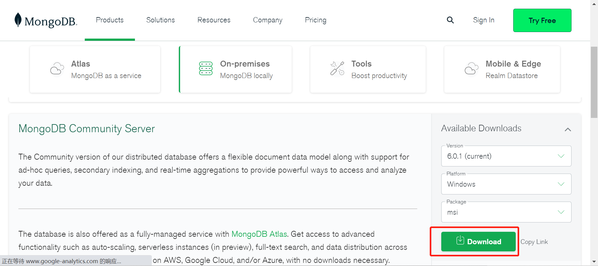
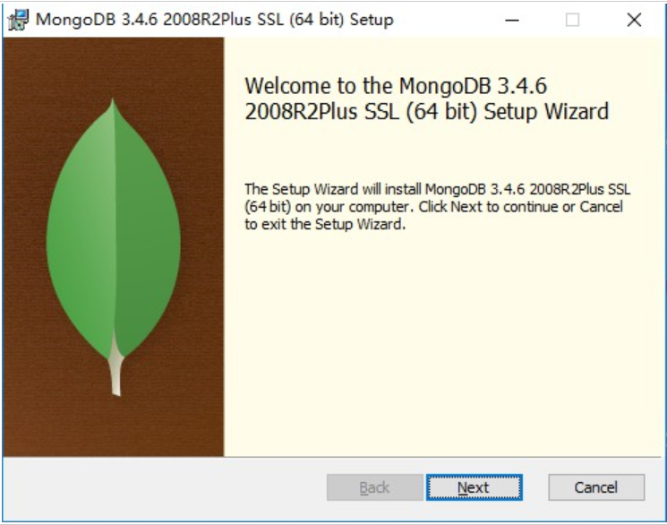
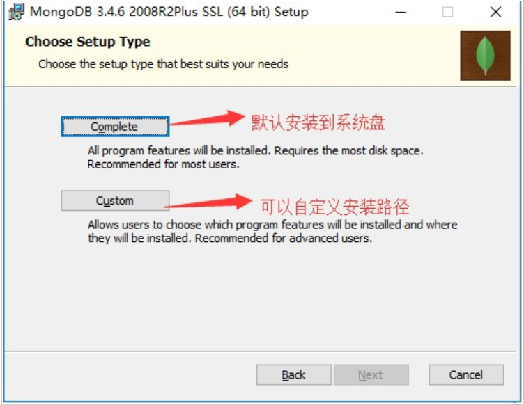
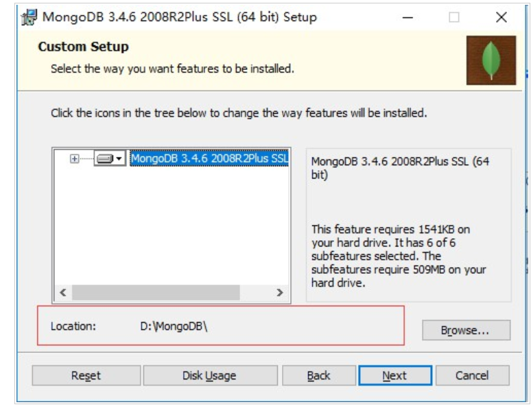
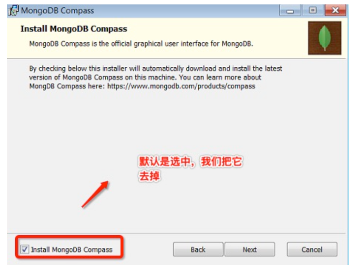
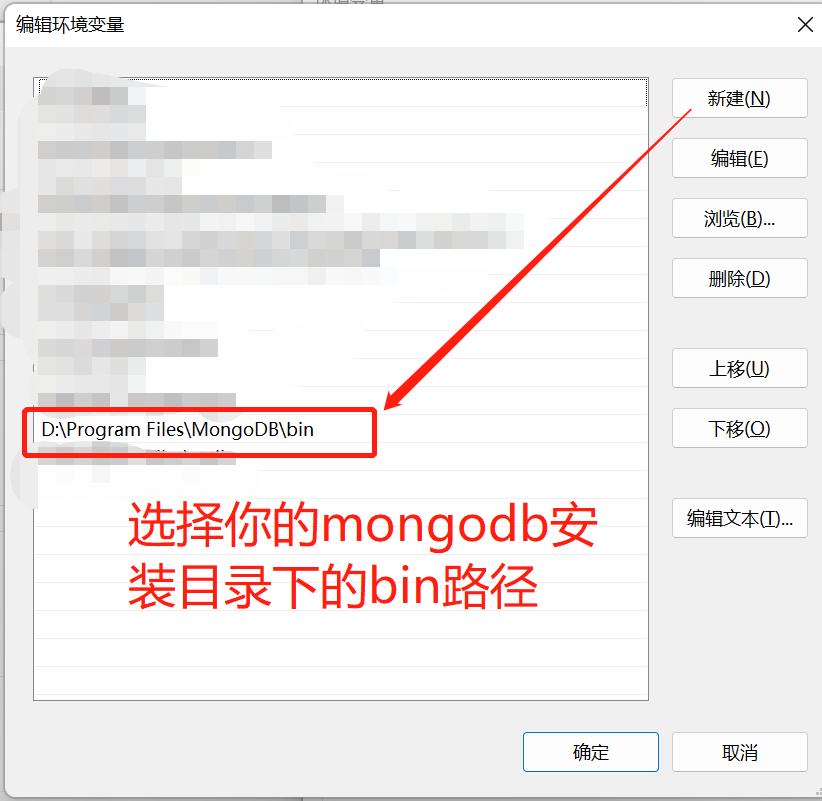
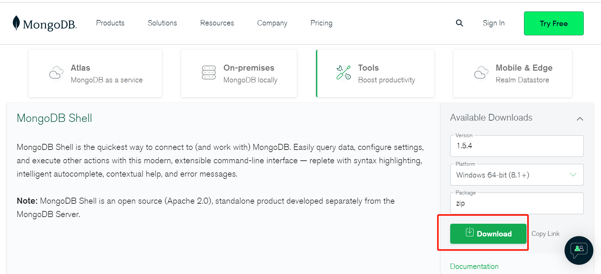
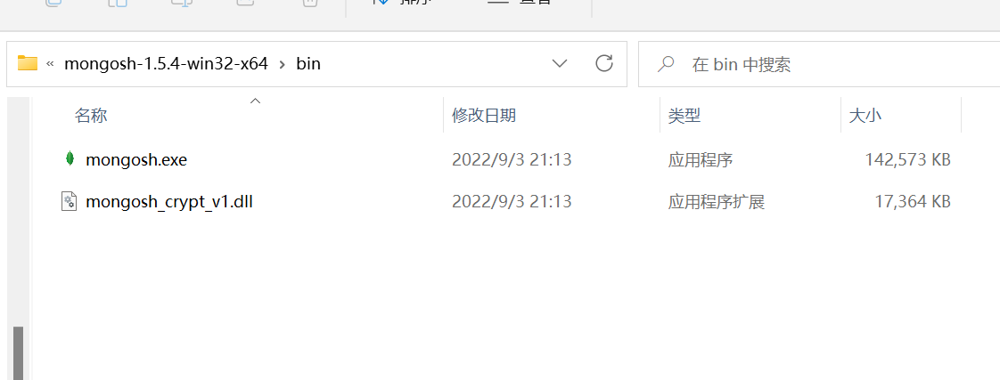
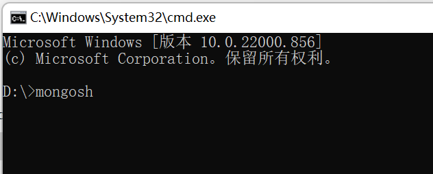

## Windows平台安装MongoDB
### 下载以及安装
https://www.mongodb.com/try/download/community

选择对应的安装包平台和版本。

下载 .msi 文件，下载后双击该文件，按操作提示安装即可。

步骤1：选中并双击安装文件，选择“next”进行安装：

步骤2：勾选上(I accept the terms in the License Agreement)，并点击“Next”，进入下一步：

步骤3：选择Custom选项自定义安装路径（默认安装是在C盘），点击"Next"：

步骤4：选择安装盘并安装(点击 Browse… 选择你要安装的盘，选择好安装的盘后在点击Next。注意：记住你安装在某盘的路径，后面配置环境变量要用到。)

步骤5：设置数据库数据和日志存放目录，可以自己选择目录或者使用默认的，然后点击Next按钮进行安装：

步骤6：安装 "install mongoDB compass" （当然你也可以选择安装它），MongoDB Compass 是一个图形界面管理工具，我们可以在后面自己到官网下载安装，下载地址：https://www.mongodb.com/try/download/compass

### 环境变量配置
复制mongodb安装的bin目录 如：D:\Program Files\MongoDB\bin

打开系统属性》高级》环境变量 》 系统环境》path》编辑新增mongodb安装的bin目录

v6.0版本前：
这个时候已经可以 cmd 输入：mongo命令 看看是否成功

v6.0版本后：
需要再下载个MongoDB Shell ：https://www.mongodb.com/try/download/shell

cmd 输入：mongosh命令 看看是否成功

### 启动服务

这个时候浏览器输入http://localhost:27017/就能看到mongo服务已经启动能够连接了。