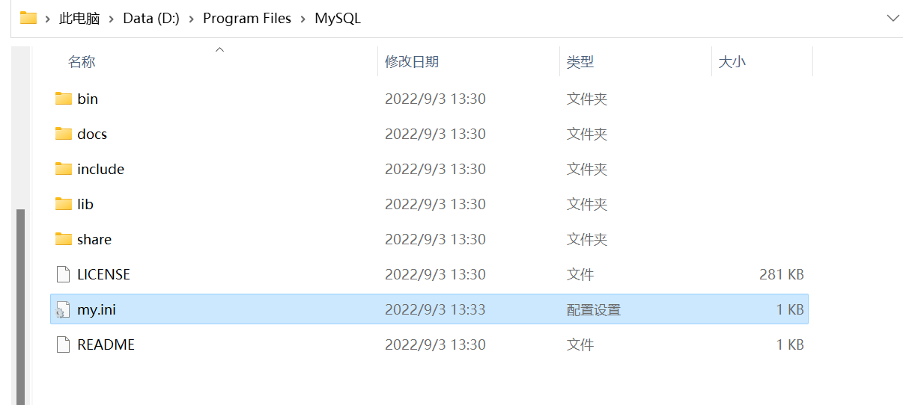
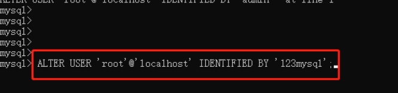

## Windows平台安装MySQL

### 下载以及安装
1、择window版本，点击下载按钮，如下所示：

https://dev.mysql.com/downloads/mysql/


2、如果需要弹出注册账号点击这里就可以


3、下载好mysql安装包后，将其解压到指定目录，并记下解压的目录，后续用于环境变量配置，并且在bin目录同级下创建一个文件，命名为my.ini



4、编辑my.ini文件，文件内容如下：


```
[mysqld]
# 设置3306端口
port=3306
# 设置mysql的安装目录 ---这里输入你安装的文件路径----
basedir=D:\Program Files\MySQL
# 设置mysql数据库的数据的存放目录
datadir=D:\Program Files\MySQL\data
# 允许最大连接数
max_connections=200
# 允许连接失败的次数。
max_connect_errors=10
# 服务端使用的字符集默认为utf8
character-set-server=utf8
# 创建新表时将使用的默认存储引擎
default-storage-engine=INNODB
# 默认使用“mysql_native_password”插件认证
#mysql_native_password
default_authentication_plugin=mysql_native_password
[mysql]
# 设置mysql客户端默认字符集
default-character-set=utf8
[client]
# 设置mysql客户端连接服务端时默认使用的端口
port=3306
default-character-set=utf8
```

有两点需要注意修改的：<br>
A、basedir这里输入的是mysql解压存放的文件路径<br>
B、datadir这里设置mysql数据库的数据存放目录(可以自行设置目录)<br>

5、打开cmd进入mysql的bin文件下，依次执行命令


6、在cmd上执行第一条命令：<br>
// 安装mysql  安装完成后Mysql会有一个随机密码<br>
mysqld --initialize --console

执行结果如下：


注意：<br>
A、**一定要保存截图，里面有安装的初始密码**！！！！<br>
B、安装过程中可能会提示以下问题<br>

7、接下来在cmd执行第二条命令：<br>
// 安装mysql服务并启动<br>
mysqld --install mysql
<br>


### 环境变量配置

进入电脑的环境变量


新建系统变量：
变量名：MYSQL_HOME
变量值：文件的解压目录


修改系统的path变量
编辑path，进去后添加 %MYSQL_HOME%\bin


### 启动服务

点击桌面我的电脑，右键选择管理进去，找到mysql服务，右键启动：


继续在cmd上执行以下命令：

mysql -uroot -p

回车后输入上面安装时保存的初始密码，进入mysql里面：


在mysql里面继续执行以下命令：


回车按照指引执行完后，代表密码修改成功，再输入exit;退出即可
