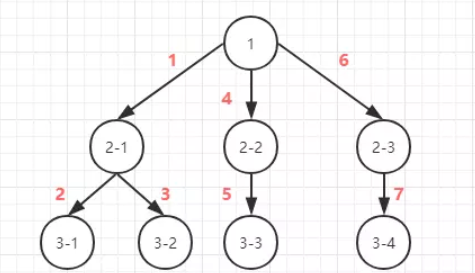
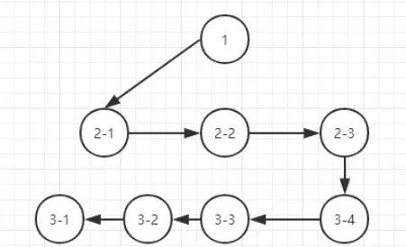

### 什么是深度优先和广度优先

其实简单来说 深度优先就是自上而下的遍历搜索 广度优先则是逐层遍历, 如下图所示

1.深度优先搜索（DFS，Depth First Search）


2.广度优先搜索（BFS，Breadth First Search）



### 两者的区别

对于算法来说 无非就是时间换空间 空间换时间

1. 深度优先不需要记住所有的节点, 所以占用空间小, 而广度优先需要先记录所有的节点占用空间大
2. 深度优先有回溯的操作(没有路走了需要回头)所以相对而言时间会长一点

深度优先采用的是堆栈的形式, 即先进后出
广度优先则采用的是队列的形式, 即先进先出

### 具体代码
```javascript
const data = [
  {
    name: 'a',
    children: [
      { name: 'b', children: [{ name: 'e' }] },
      { name: 'c', children: [{ name: 'f' }] },
      { name: 'd', children: [{ name: 'g' }] },
    ],
  },
  {
    name: 'a2',
    children: [
      { name: 'b2', children: [{ name: 'e2' }] },
      { name: 'c2', children: [{ name: 'f2' }] },
      { name: 'd2', children: [{ name: 'g2' }] },
    ],
  }
]

// 深度遍历, 使用递归
function getName(data) {
  const result = [];
  data.forEach(item => {
    const map = data => {
      result.push(data.name);
      data.children && data.children.forEach(child => map(child));
    }
    map(item);
  })
  return result.join(',');
}

// 广度遍历, 创建一个执行队列, 当队列为空的时候则结束
function getName2(data) {
  let result = [];
  let queue = data;
  while (queue.length > 0) {
    [...queue].forEach(child => {
      queue.shift();
      result.push(child.name);
      child.children && (queue.push(...child.children));
    });
  }
  return result.join(',');
}
console.log(getName(data))
console.log(getName2(data))
```